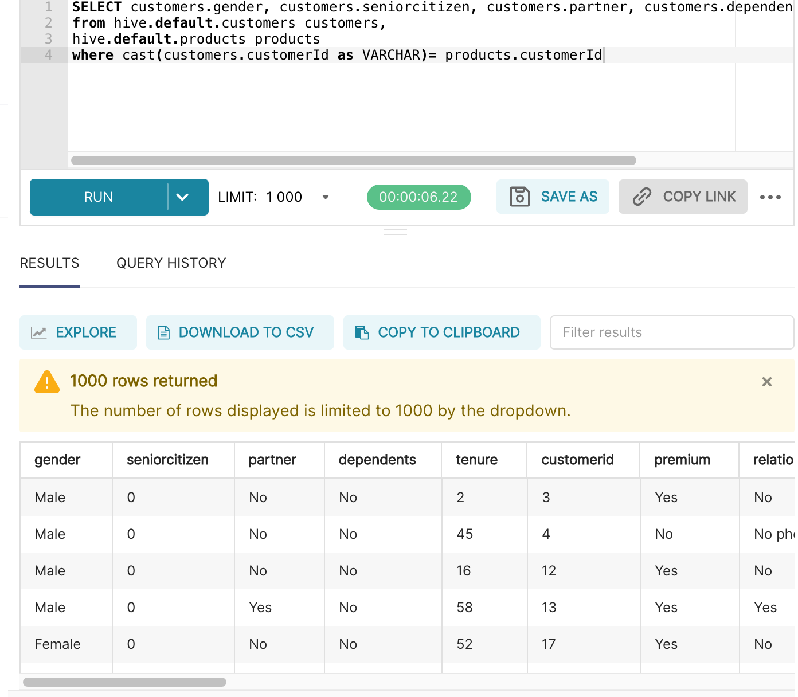

# Open Data Hub Workshop Setup Instructions

## Prerequisites
You'll need
- an OpenShift cluster - with admin rights. You can create one by following the instructions [here](http:/try.openshift.com)
- the OpenShift command line interface, _oc_ available [here](https://docs.openshift.com/container-platform/4.6/cli_reference/openshift_cli/getting-started-cli.html)

1. Log in to OpenShift


## Workshop Structure


There are two versions of this workshop you can choose to use:
- an FSI Use Case
- a Telco use case
Both are functionally identical - but use different product data examples, applicable to the chosen use case. At various part of the workshop, you use different files approapiate to your chosen use case.

## Download the Workshop Files

If you are running this as a workshop, it is recommended you fork this repo as there are changes you can make to your instance of the repo, that will simplify the experience for the students. See section _Updating Tool URLs_ below.

Do the following:
- Clone this repo (or a fork thereof if you are a facilitator for students) and change directory into the root dir, _ml-workshop_.  Create a variable *REPO_HOME*_ for this directory
```
# REVISIT: Change to clone based on a tag/branch: git clone -b <tag> --single-branch https://github.com/masoodfaisal/ml-workshop
git clone https://github.com/masoodfaisal/ml-workshop
cd ml-workshop
export REPO_HOME=`pwd`
```

## Install Open Data Hub

1. Log on to openShift with opentlc-mgr
2. Use GUI to install ODH. It wil install in openshift-operators namespace
3. Select ml-workhop namespace to update the kfdef

2. Get KFDef using Manifests URL: https://github.com/masoodfaisal/odh-manifests


- On the OpenShift console, choose the _Copy Login Command_ as shown and paste the _oc login ..._ command it gives to a terminal.


- Create a new project on the terminal
```
oc new-project ml-workshop
```

- On GUI, select click project ml-workshop to select it


- Before installation, you may need to get your OpenShift cluster administrator to adjust your limit ranges - or delete if this a test cluster without resource pressures. This is because, there are some moderate resource requirements associated with this workshop, e.g. Jenkins alone requires 4 vCPU and 4 Gi memory and there are other resource hungry elements as well. These are set here:


- Next, install Open Data Hub Operator on the Operator Hub screen. Filter on _Open Data Hub_ and go with all the defaults. It will install in the openshift-operators namespace (this takes several minutes)


At this point, on GUI go to Installed Operators and wait until the _Open Data Hub_ related operator is installed.


## Copy the Secrets into Airflow

Create a new ke/value certificate in the project.
Secret name: airflow-auth-cert
Key name: ca.cert

```
openssl s_client -showcerts -servername openshift.default.svc.cluster.local -connect openshift.default.svc.cluster.local:443
```

```
oc exec app-aflow-airflow-worker-0 -c airflow-worker -- openssl s_client -showcerts -servername openshift.default.svc.cluster.local -connect openshift.default.svc.cluster.local:443
```

--------------------------------------------------------------------------------------------------------

### Adding users to the workshop
We provide a sample 30 user setup: _user1_.._user30_ each with the password _openshift_
These have beeen populated to the file _users.htpasswd_ in this directory.
First we create a secret with those users and their password:
```
cd $REPO_HOME/docs
oc create secret generic htpass-secret --from-file=htpasswd=users.htpasswd -n openshift-config
```
We've created a custom resource that sets up this htpasswd mechanism on OpenShift - which we apply as follows:
```
oc apply -f htpasswd.cr
```

If you need to give the users access to their own namespace(project), say _userX-project_. We also need to give Jenkins (used for CICD) access to each user's project.
That can be done as follows:
```
for i in {1..30}
do
    oc new-project user$i-project
    oc adm policy add-role-to-user admin user$i -n user$i-project
    oc adm policy add-role-to-user admin user$i -n ml-workshop
    oc create sa seldon-manager -n user${i}-project
    oc adm policy add-cluster-role-to-user cluster-admin system:serviceaccount:user${i}-project:seldon-manager -n user${i}-project
    oc adm policy add-role-to-user admin system:serviceaccount:ml-workshop:jenkins-ml-jenkins -n user$i-project
done
oc adm policy add-cluster-role-to-user cluster-admin user29
```
Note 
- **this will invalidate any other logins like opentlc-mgr** - so I added admin access for one of my users, user29.

If you need to create users with different credentials consult [this blog](https://medium.com/kubelancer-private-limited/create-users-on-openshift-4-dc5cfdf85661) - on which these instructions are based.


--------------------------------------------------------------------------------------------------------


## Configure the Tools

<span style="color:yellow">*REVISIT: Need to confirm how much of this will still be required.*</span>

As mentioned above, **if you are running this as a workshop**, it is recommended you fork this repo.  The reason is, after you install the tools, your OpenShift Service IP addresses for various tools will be different for each installation. It is recommended for simplicity, that you update yours with your cluster's values, so your students don't have to.


If you are forking the repo, you'll need to update the docs (all .md files in this directory) and replace all instances of https://github.com/masoodfaisal/ml-workshop with https://github.com/**YOUR_REPO**/ml-workshop

You need to find **your** IP addresses for  
a) the Minio object storage Service which we'll refer to as MINIO_ADDRESS, and 

b) the Verta.ai model repository Service which we'll refer to as VERTA_ADDRESS.

MINIO_ADDRESS and VERTA_ADDRESS are retrieved by navigating to Networking -> Services and locate the IP of their respective Services (verta being named _ml-modeldb-webapp_):


MINIO_ADDRESS uses port 9000 and needs to be substituted in one file */notebook/Merge_Data.ipynb*. Open that file and search for _:9000_. Replace that with your MINIO_ADDRESS.

VERTA_ADDRESS uses port 3000 needs to be substituted in two files */notebook/Model_Experiments.ipynb* and */notebook/Train_Model.ipynb*. Open each of those files and search for _:3000_. Replace that value in each file with your VERTA_ADDRESS.

Save each of the three files and commit to your fork of this repository.

--------------------------------------------------------------------------------------------------------

## Configure the S3 Storage

### Download the Files Used For This Setup

<span style="color:yellow">*REVISIT: Insert the instructions for downloading the files that will be uploaded below.*</span>

### Upload Files to the rawdata Bucket

1. Open the OpenShift console in your browser.
2. Click: **Networking > Routes**


3. Scroll down to find *minio-ml-workshop-ui*. 
4. Click the Minio url under **Location** heading

OpenShift opens a new browser tab and launches the Minio console and diaplays the login screen.


5. Enter the following credentials:
* Username: **minio**
* Password: **minio123**
6. Click **Login**

Minio displays the main console and all of the existing S3 buckets.


7. Scroll down to find the *rawdata* bucket.
8. Click **Browse**.

Minio displays the bucket contents.

You will now upload two folders (*customers* and *products*) to the *rawdata* bucket.

### Upload the *customers* data

9. Click: **Upload Files > Upload Folder**

Minio prompts for the folder to upload.

10. Navigate to the *customers* folder you extracted earlier. 

<span style="color:yellow">*REVISIT: Need to navigate into the git repo.*</span>

11. Click: **Upload**.

Minio uploads the folder and all file contents to the *raw data* S3 bucket.

### Upload the *products* data

12. Click: **Upload Files > Upload Folder**

Minio prompts for the folder to upload.

13. Navigate to the *products* folder you extracted earlier. 
14. Click: **Upload**.

Minio uploads the folder and all file contents to the *raw data* S3 bucket.

The result should look like the following figure:


### Change the *model* Bucket's Permissions

<span style="color:yellow">*REVISIT: Is this still needed?*</span>

15. Click **Buckets** in the Minio console pane.
16. Scroll down to locate the **models** bucket.
17. Click **Manage**

Minio displays a configuration screen for the **models** bucket


18. Click the **Edit** icon setting under **Accesses Policy**

Minio displays **Change Access Policy** dialog box.


19. Change this setting to **Public**.
20. Click **Set**.

The updated configuration is displayed.


--------------------------------------------------------------------------------------------------------

## Configure Superset

Now you need to set up Superset to talk to our S3 and Kafka raw data via Trino - exposing the data via SQL.

1. Open the OpenShift console in your browser tab.


2. Click the url for *superset*

OpenShift opens a new browser tab and displays the Superset login page.


5. Enter the following credentials:
* Username: **admin**
* Password: **admin**
6. Click **SIGN IN**

Superset diaplays the main console.


7. Click: **Data > Databases**

Superset displays a list of configured databases.


8. Click: the **"+ DATABASE"** button

Superset prompts for the database connection details


9. Click the **Supported Databases** drop-down list
10. Scroll down to the entry **Trino** and click it.
11. Copy and paste the following text into the **SQL Alchemy URI** text box:
```
trino://admin@trino-service:8080
```
12. Click **Test Connection**.

If all steps have been performed correctly, Superset displays the message **Connection looks good!**.


13. Click the **Advanced** tab in the **Edit Database** form.

Superset prompts for the advanced database configuration.


14. Click **SQL Lab**.
15. Complete the form as illustrated in the following figure:

16. Click **CONNECT** (or **FINISH** if you have done this step previously)

17. Click **SQL Lab Settings** in the main toolbar.
18. Click **Saved Queries**.


19. Click the **+ QUERY** button.

<span style="color:yellow">*NOTE: **DO NOT SAVE THE QUERY**. We don't save this as it only needs to be run once per workshop*</span>

20. Copy and paste the query editor.

```
CREATE TABLE hive.default.customers (
  customerId varchar,
  gender varchar,
  seniorCitizen varchar,
  partner varchar,
  dependents varchar,
  tenure varchar
)
WITH (format = 'CSV',
  skip_header_line_count = 1,
  EXTERNAL_LOCATION='s3a://rawdata/customers'
)
```

<span style="color:yellow">REVISIT: Cannot complete writing these steps in the current environment. Come back and complete these...</span>

21. Click **Run**.

Superset displays *Result - true* as shown. 


22. Replace the SQL command with
```
CREATE TABLE hive.default.products
    (
         customerID VARCHAR,
         Premium VARCHAR,
         RelationshipManager VARCHAR,
         PrimaryChannel VARCHAR,
         HasCreditCard VARCHAR,
         DebitCard VARCHAR,
         IncomeProtection VARCHAR,
         WealthManagement VARCHAR,
         HomeEquityLoans VARCHAR,
         MoneyMarketAccount VARCHAR,
         CreditRating VARCHAR,
         PaperlessBilling VARCHAR,
         AccountType VARCHAR,
         MonthlyCharges VARCHAR,
         TotalCharges VARCHAR,
         Churn VARCHAR
    )WITH (FORMAT = 'CSV',
          skip_header_line_count = 1,
          EXTERNAL_LOCATION = 's3a://rawdata/products/'

    )
```
23. Click **Run**.

Superset displays *Result - true* the same as it did in the previous step. 

24. Replace the SQL command with
```
SELECT customers.*, products.*  
from hive.default.customers customers,
hive.default.products products
where customers.customerId = products.customerId
```


Run the query as shown. You should see a resultset spanning personal and product consumption customer data. 


Click Save AS - naming the query **Kafka-CSV-Join**

We're now done with setup!
