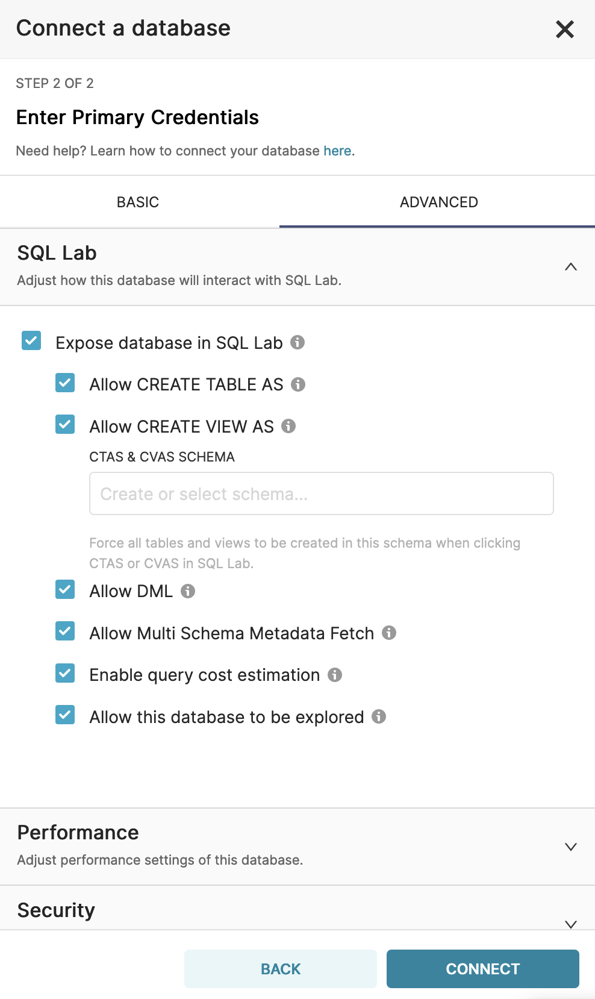

# Open Data Hub Workshop Setup Instructions

## Prerequisites
You'll need
- an OpenShift cluster - with admin rights. You can create one by following the instructions [here](http:/try.openshift.com)
- the OpenShift command line interface, _oc_ available [here](https://docs.openshift.com/container-platform/4.6/cli_reference/openshift_cli/getting-started-cli.html)


## Workshop Structure


There are two versions of this workshop you can choose to use:
- an FSI Use Case
- a Telco use case
Both are functionally identical - but use different product data examples, applicable to the chosen use case. At various part of the workshop, you use different files approapiate to your chosen use case.

## Download the Workshop Files

If you are running this as a workshop, it is recommended you fork this repo as there are changes you can make to your instance of the repo, that will simplify the experience for the students. See section _Updating Tool URLs_ below.

Do the following:
- Clone this repo (or a fork thereof if you are a facilitator for students) and change directory into the root dir, _ml-workshop_.  Create a variable *REPO_HOME*_ for this directory

*<span style="color:yellow">REVISIT: Change to clone based on a tag/branch:  
git clone -b tag --single-branch https:// github.com/masoodfaisal/ml-workshop<span>*

```
git clone https://github.com/masoodfaisal/ml-workshop
cd ml-workshop
export REPO_HOME=`pwd`
```

## Install the Open Data Hub Operator

1. Log on to openShift with opentlc-mgr
2. Select the Administrator perspective
3. Install the Open Data Hub operator. Click **Operators > Operator Hub**  
   OpenShift displays the operator catalogue.  
4. Click the *Filter by keybord* text box and type *open data hub*  
   OpenShift displays the *Open Data Hub Operator* tile.
5. Click the tile  
   OpenShift displays a Commmunity Operator warning dialog box.
6. Click **Continue**  
   OpenShift displays the operator details.
7. Click **Install**  
   OpenShift prompts for the operator configuration details. 
     
8. Accept all defaults and click **Install*  
   OpenShift installs the operator and displays a diaglog box once complete.  
   
9. Click **View Operator**  
    OpenShift displays the operator details.
     

The Open Data Hub Operator is now installed. Proceed to create the workshop project and install Open Data Hub

## Project Creation & ODH Installation Steps
We will now create the workshop's project and install Open Data Hub into the project.  
Before we do this we need to copy the Open Data Hub KfDef file that will instruct the operator which tools to install and how to configure them.

Later in these steps you will also need to:  
a. Edit the KfDef file you create in OpenShift with the URL of your cluster. Pay careful attention to those steps or Airflow will not run.  
b. Update the certificate for Airflow.

### Prerequisite Step:
Before installing Open Data Hub you need to copy the KFDef file from a oublic git repository.
1. Open the KFDef File from the github repository: https://github.com/masoodfaisal/odh-manifests/blob/master/kfdef/ml-workshop-limited.yaml
2. Click the **Copy Raw Contents** button  to copy the file contents to your clipboard. 

Keep this in the clipboard, you will use it shortly.

### Create the Workshop's Project and Install ODH
1. Create the **ml-workshop** project:  
   1.1 Click **Home > Projects**  
   1.2 Click the **Create Project** button on the top right of the screen  
   1.3 Click the **Name** text box and type  **ml-workshop**  
   1.4 Click **Create**  
   OpenShift creates the project.  
     
2. Delete the Limit Range for the project  
   2.1 Click **Administration > LimitRanges**  
   2.2 Click the hambuger button for the **ml-workshop-core-resource-limits**.
     
   2.3 Click **Delete LimitRange**  
   OpenShift removes the LImitRange for the project.
2. Install Open Data Hub  
   2.1 Click **Operators > Installed Operators**  
   OpenShift displays all the operators currently installed.  
   <span style="color:yellow">**Note that the ml-workshop project is unselected and **All Projects** is selected. You must make ml-workshop the active project.**<span> 

   2.2 Click the **Projects** drop-down list and click **ml-workshop**  
     
   2.3 Click **Open Data Hub Operator**.  
   OpenShift displays the operator's details.  
     
   2.4 Click **Open Data Hub** in the operator toolbar.  
   OpenShift displays the operand details - of which there are none.
     
   2.5 Click the **Create KfDef** button.  
   2.6 Click the **YAML View** radio button  
   OpenShift displays the KfDef YAML editor.  
     
   2.7 Replace the entire YAML file with the KfDef YAML you copied to your clipboard in the *Prerequisits* step above.  
   This KfDef file will tell OpenShift how to install and configure ODH.  
   Before you save the KfDef you must edit one line of code.  
   2.8 Locate the **airflow2** overlay in the code  
     
   Around line 57 you will see a **value** field that contains part of the URL to your OpenShift clister.  
   2.9 Replace the value with the the URI of **your** cluster from the *.apps* through to the *.com* as follows:   
```
       - kustomizeConfig:
        overlays:
          - custom-image
        parameters:
          - name: OCP_APPS_URI
            # TODO: Change this uri before applying the KfDef
            value: .apps.cluster-9482.9482.sandbox744.opentlc.com
        repoRef:
          name: manifests
          path: ml-workshop-airflow2
```  
  2.10 Click **Create**  
       OpenShift creates the KfDef and proceeeds to deploy ODH.  
  2.11 Click **Workloads > Pods** to observe the deployment progress.  
        
      You may observe that the Airflow Scheduler and possible the Airflow Worker are in Crashloop Backoff. That is because a certificate update is required.

### Update the Airflow Certificate
1. On the OpenShift console, click *opentlc-mgr > Copy login command**  
     
   OpenShift opens a new window and prompts you to log in.
2. Log in with your open-tlc credentials.  
3. Click **Display Token**  
     
4. Copy the oc login command and paaste it in a terminal window.  
   You have now logged on to the cluster from the terminal.
5. In the terminal window, open the **ml-workshop** project  
    ```
    $ oc project ml-workshop
    Now using project "ml-workshop" on server "https://api.cluster-034d.034d.sandbox1072.opentlc.com:6443".
    ```

The next steps will retrieve two certificates from the Airflow Worker Pod and save them in a secret.

6. Copy and paste the following command into the terminal window:
    ```
    oc exec app-aflow-airflow-worker-0 -c airflow-worker -- openssl s_client -showcerts -servername openshift.default.svc.cluster.local -connect openshift.default.svc.cluster.local:443
    ```  
    OpenShift will display all of the certificate information.
7. Copy the text from the the beginning of the first *-----BEGIN CERTIFICATE-----* to the end of the last *-----END CERTIFICATE-----* into a text editor.
8. Using the following example, remove the two lines between the two certificates, and check there are no trailing spaces at the end of any lines. (Note: the example below has been editied for brevity. Your certificate will be larger.)  
    ```
    -----BEGIN CERTIFICATE-----
    MIIELDCCAxSgAwIBAgIIOfIXBS41fYQwDQYJKoZIhvcNAQELBQAwRDESMBAGA1UE
    CxMJb3BlbnNoaWZ0MS4wLAYDVQQDEyVrdWJlLWFwaXNlcnZlci1zZXJ2aWNlLW5l
    dHdvcmstc2lnbmVyMB4XDTIyMDMwMjA2MTkwM1oXDTIyMDQwMTA2MTkwNFowFTET
    MBEGA1UEAxMKMTcyLjMwLjAuMTCCASIwDQYJKoZIhvcNAQEBBQADggEPADCCAQoC
    AYxPddEpWo10StKSv3tOvDghTg58Ly6p5qenWT44dWarHN2QOw9L0YPSR99yLiTk
    nH0MsLR09gfo55CbjkJfOnOYj0bLkSCTn8a+kj3WFT9HYlH73Fw/6fR8KQSiB/Ka
    mOLMK7NtDILiFxBRWcHz3PKHj2ftFlwU3iKcpT7nMmyIGg3eg+4kqaJ+0pns11y2
    UUP92UDl4VTdux3ZHCp/SxMOR7Cni0Wpw/h5cePeWzTOht+tgn3ajKoRbwxHKRGF
    K6xZpWhrRMw/ZTeKwNyFUhcxHaKCgBljWFdNDVxurZQSmlNJTBJkwl7hUY4jY5ZC
    tq/eBzgxGaCQyeBiM6x2uw==
    -----END CERTIFICATE-----
    -----BEGIN CERTIFICATE-----
    MIIDTDCCAjSgAwIBAgIIUg78yUMH32swDQYJKoZIhvcNAQELBQAwRDESMBAGA1UE
    CxMJb3BlbnNoaWZ0MS4wLAYDVQQDEyVrdWJlLWFwaXNlcnZlci1zZXJ2aWNlLW5l
    dHdvcmstc2lnbmVyMB4XDTIyMDMwMjA2MDk0MFoXDTMyMDIyODA2MDk0MFowRDES
    MBAGA1UECxMJb3BlbnNoaWZ0MS4wLAYDVQQDEyVrdWJlLWFwaXNlcnZlci1zZXJ2
    KoZIhvcNAQELBQADggEBAGSuwM9jWTi8DHryZvjr7KAmvmBptA/uKpybYaiv2X8s
    fY7DAErbQ50yaLRBOjJNGa1bRLuozEN+ggOBwMGz3+m/ouf9/wI6bSzxd9Y49qHA
    ikw7w6nLq9KJNU6CxubOjhaTypvwTF6hysV8iNyYZe/4TkuUV36KriXom9CiLAWJ
    2MvwWFay9h/761mBgxEFyfpFBkJwzSf6wteD37LZ8BbG4TqSl++jNcjBvjf0u7iL
    yvYhNFOC7bJuNNDxxGJ/Oboq8LGyWYTy1T2ruFmBNYW0XsfxfHvfDYFRljVLyCOw
    H7T/POEnc8u/FOPzIMeFgpHwX4btCNs3YTQFAkXT+e4=
    -----END CERTIFICATE-----
    ```

6. Click **Workloads > Secrets**  
   OpenShift displays all secrets in the ml-workshop project.
7. Click the **Create** button on the top right of the screen.
8. Click **Key/Value secret**  
     
9. Click **Create**  
   The certificate is installed.
10. Force the pods to load the certificate.  
    10.1 Click the **hamgurger button** on the **app-airflow-worker-0 pod**
    10.2 Click **Delete Pod**
     
10. Open the Pods view: Click **Workloads > Pods**  
    Observe that the airflow scheduler changes from *Crashloop Backoff* to Running.  
     
   OpenShift restarts the pod and Airflow reaches a steady state.

## Installation Complete
The installation phase of Open Data Hub is now complete. Next you will configure the workshop environment.

--------------------------------------------------------------------------------------------------------

# Workshop Configuration

### Adding users to the workshop
If you are running ODH for a a workshop then you need to configure the users. If you are using the environment as a demo then you can jump forward to the **Configure Tools** section.

1. In a terminal window, type the following commands:
```
cd $REPO_HOME/setup
./setup-users.sh
```


<span style="color:yellow">**Note: User configuration will invalidate any other logins like opentlc-mgr**.  
For cluster-admin access you should now use **user29**.<span>

If you need to create users with different credentials consult [this blog](https://medium.com/kubelancer-private-limited/create-users-on-openshift-4-dc5cfdf85661) - on which these instructions are based.

The password for all users is **openshift**.

--------------------------------------------------------------------------------------------------------


## Configure the Tools

<span style="color:yellow">*REVISIT: Need to confirm how much of this will still be required.*</span>

As mentioned above, **if you are running this as a workshop**, it is recommended you fork this repo.  The reason is, after you install the tools, your OpenShift Service IP addresses for various tools will be different for each installation. It is recommended for simplicity, that you update yours with your cluster's values, so your students don't have to.


If you are forking the repo, you'll need to update the docs (all .md files in this directory) and replace all instances of https://github.com/masoodfaisal/ml-workshop with https://github.com/**YOUR_REPO**/ml-workshop

You need to find **your** IP addresses for  
a) the Minio object storage Service which we'll refer to as MINIO_ADDRESS, and 

b) the Verta.ai model repository Service which we'll refer to as VERTA_ADDRESS.

MINIO_ADDRESS and VERTA_ADDRESS are retrieved by navigating to Networking -> Services and locate the IP of their respective Services (verta being named _ml-modeldb-webapp_):

MINIO_ADDRESS uses port 9000 and needs to be substituted in one file */notebook/Merge_Data.ipynb*. Open that file and search for _:9000_. Replace that with your MINIO_ADDRESS.

VERTA_ADDRESS uses port 3000 needs to be substituted in two files */notebook/Model_Experiments.ipynb* and */notebook/Train_Model.ipynb*. Open each of those files and search for _:3000_. Replace that value in each file with your VERTA_ADDRESS.

Save each of the three files and commit to your fork of this repository.

--------------------------------------------------------------------------------------------------------

## Configure the S3 Storage

### Download the Files Used For This Setup

<span style="color:yellow">*REVISIT: Insert the instructions for downloading the files that will be uploaded below.*</span>

### Upload Files to the rawdata Bucket

1. Open the OpenShift console in your browser.
2. Click: **Networking > Routes**  

  

3. Scroll down to find *minio-ml-workshop-ui*. 
4. Click the Minio url under **Location** heading  
OpenShift opens a new browser tab and launches the Minio console and diaplays the login screen.


5. Enter the following credentials:  
* Username: **minio**
* Password: **minio123**
6. Click **Login**  
Minio displays the main console and all of the existing S3 buckets.  


7. Scroll down to find the *rawdata* bucket.
8. Click **Browse**.  
Minio displays the bucket contents.  

You will now upload two folders (**customers** and **products**) to the *rawdata* bucket.

### Upload the *customers* data

9. Click: **Upload Files > Upload Folder**  

     

Minio prompts for the folder to upload.

10. Navigate to the data files directory within the git repository
  ```
  $REPO_HOME/data-files
  ```
11. Click the **customers** folder.   

 

11. Click: **Upload**.  
Minio uploads the folder and all file contents to the *raw data* S3 bucket.

12. Click the **Clean Complete Objects** button  to reveal the hidden upload controls. 

### Upload the *products* data

13. Repeat the above steps to upload the **products** folder.  
The result should look like the following figure:  

 

### Change the *model* Bucket's Permissions

<span style="color:yellow">*REVISIT: Is this still needed?*</span>

15. Click **Buckets** in the Minio console pane.
16. Scroll down to locate the **models** bucket.
17. Click **Manage**

Minio displays a configuration screen for the **models** bucket

  

18. Click the **Edit** button   under **Accesses Policy**  
Minio displays **Change Access Policy** dialog box.

  

19. Change this setting to **Public**.
20. Click **Set**.

The updated configuration is displayed.

  

--------------------------------------------------------------------------------------------------------

## Configure Superset

Now you need to set up Superset to talk to our S3 and Kafka raw data via Trino - exposing the data via SQL.

1. Open the OpenShift console in your browser tab.


2. Click the url for *superset*

OpenShift opens a new browser tab and displays the Superset login page.


5. Enter the following credentials:
* Username: **admin**
* Password: **admin**
6. Click **SIGN IN**

Superset diaplays the main console.


7. Click: **Data > Databases**

Superset displays a list of configured databases.


8. Click: the **"+ DATABASE"** button

Superset prompts for the database connection details


9. Click the **Supported Databases** drop-down list
10. Scroll down to the entry **Trino** and click it.
11. Copy and paste the following text into the **SQL Alchemy URI** text box:
```
trino://admin@trino-service:8080
```
12. Click **Test Connection**.

If all steps have been performed correctly, Superset displays the message **Connection looks good!**.


13. Click the **Advanced** tab in the **Edit Database** form.

Superset prompts for the advanced database configuration.


14. Click **SQL Lab**.
15. Complete the form as illustrated in the following figure:

16. Click **CONNECT** (or **FINISH** if you have done this step previously)

17. Click **SQL Lab Settings** in the main toolbar.
18. Click **Saved Queries**.


19. Click the **+ QUERY** button.

<span style="color:yellow">*NOTE: **DO NOT SAVE THE QUERY**. We don't save this as it only needs to be run once per workshop*</span>

20. Copy and paste the query editor.

```
CREATE TABLE hive.default.customers (
  customerId varchar,
  gender varchar,
  seniorCitizen varchar,
  partner varchar,
  dependents varchar,
  tenure varchar
)
WITH (format = 'CSV',
  skip_header_line_count = 1,
  EXTERNAL_LOCATION='s3a://rawdata/customers'
)
```

<span style="color:yellow">REVISIT: Cannot complete writing these steps in the current environment. Come back and complete these...</span>

21. Click **Run**.

Superset displays *Result - true* as shown. 


22. Replace the SQL command with
```
CREATE TABLE hive.default.products
    (
         customerID VARCHAR,
         Premium VARCHAR,
         RelationshipManager VARCHAR,
         PrimaryChannel VARCHAR,
         HasCreditCard VARCHAR,
         DebitCard VARCHAR,
         IncomeProtection VARCHAR,
         WealthManagement VARCHAR,
         HomeEquityLoans VARCHAR,
         MoneyMarketAccount VARCHAR,
         CreditRating VARCHAR,
         PaperlessBilling VARCHAR,
         AccountType VARCHAR,
         MonthlyCharges VARCHAR,
         TotalCharges VARCHAR,
         Churn VARCHAR
    )WITH (FORMAT = 'CSV',
          skip_header_line_count = 1,
          EXTERNAL_LOCATION = 's3a://rawdata/products/'

    )
```
23. Click **Run**.

Superset displays *Result - true* the same as it did in the previous step. 

24. Replace the SQL command with
```
SELECT customers.gender, customers.seniorcitizen, customers.partner, customers.dependents, customers.tenure, products.*  
from hive.default.customers customers,
hive.default.products products
where cast(customers.customerId as VARCHAR)= products.customerId
```


Run the query as shown. You should see a resultset spanning personal and product consumption customer data. 


Click Save AS - naming the query **Kafka-CSV-Join**

We're now done with setup!
